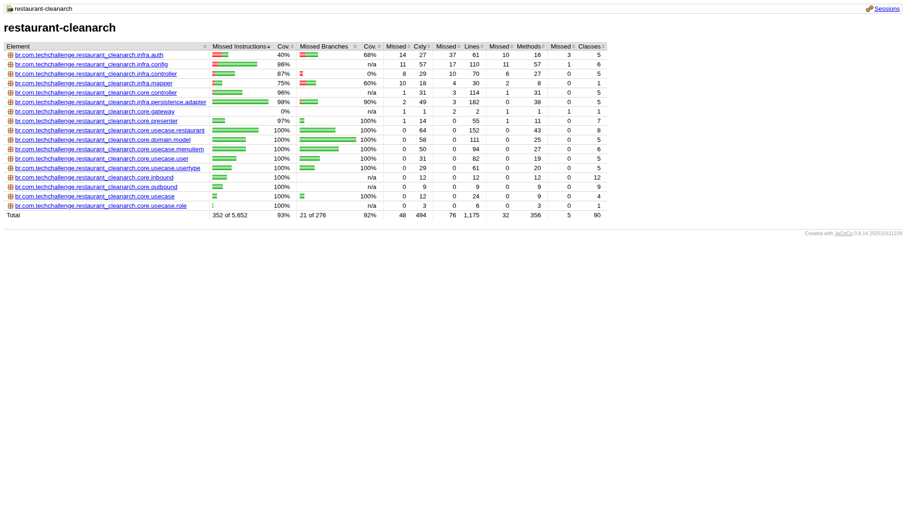

<div align="center">

# Projeto: restaurant-cleanarch

(Postech – ADJ – fase 2 – Tech Challenge)

</div>

---

## Equipe

| Nome                                             | RM       | E‑mail                  |
|--------------------------------------------------|----------|-------------------------|
| Alexandre Belisário Duarte Leite de Andrade      | RM367163 | alexbdla@gmail.com      |
| Kervin Sama Candido da Silva                     | RM367345 | kervincandido@gmail.com |

---

## Informações rápidas para teste

**Repositório:**  
[GitHub](https://github.com/alex-dev-br/restaurant-cleanarch)

### Pré-requisitos
- Docker + Docker Compose instalados

### Subir a aplicação completa (API + PostgreSQL)
Dentro da pasta `infra/`:

```bash
docker compose --profile stack up -d --build
```

**Acesso após subir:**

- Healthcheck: `http://localhost:8080/actuator/health`
- Swagger UI: `http://localhost:8080/swagger-ui/index.html` 

Para derrubar:

```bash
docker compose --profile stack down
```

Para derrubar e apagar o banco (volumes):

```bash
docker compose --profile stack down -v
```

### Rodar testes em container (profile test com H2)
Dentro da pasta `infra/`:

```bash
docker compose --profile test run --rm tests mvn -B -ntp clean verify
```

> Os testes usam H2 em memória (`application-test.yaml`) e aplicam migrations via Flyway.

## Collection do Postman
Arquivo:  
`postman/Clean Arch Restaurantes API.postman_collection.json`

## Variáveis de ambiente (opcional)
Não é necessário criar `.env` para rodar, pois o `docker-compose` possui valores padrão.
Se quiser customizar, você pode sobrescrever via `infra/.env` com base em `infra/.env.example`.

> Obs.: se você alterar `APP_PORT`, substitua `8080` nas URLs.


___

## Sumário
- [1. Introdução](#1-introdução)
- [2. Arquitetura do Sistema (Clean Architecture)](#2-arquitetura-do-sistema-clean-architecture)
- [3. Tecnologias utilizadas](#3-tecnologias-utilizadas)
- [4. Descrição dos Endpoints da API](#4-descrição-dos-endpoints-da-api)
- [5. Configuração do Projeto](#5-configuração-do-projeto)
- [6. Qualidade do Código](#6-qualidade-do-código)
- [7. Collections para Teste (Postman)](#7-collections-para-teste)
- [8. Repositório do Código](#8-repositório-do-código)
- [Notas](#notas)

---

## 1. Introdução

### Descrição do problema

Na nossa região, um grupo de restaurantes decidiu contratar estudantes para construir um sistema de gestão para seus 
estabelecimentos. Essa decisão foi motivada pelo alto custo de sistemas individuais, o que levou os restaurantes a se 
unirem para desenvolver um sistema único e compartilhado. Esse sistema permitirá que os clientes escolham restaurantes 
com base na comida oferecida, em vez de se basearem na qualidade do sistema de gestão.

O objetivo é criar um sistema robusto que permita a todos os restaurantes gerenciar eficientemente suas operações, 
enquanto os clientes poderão consultar informações, deixar avaliações e fazer pedidos online. Devido à limitação de 
recursos financeiros, foi acordado que a entrega do sistema será realizada em fases, garantindo que cada etapa seja 
desenvolvida de forma cuidadosa e eficaz.

A fase 2 expande o escopo para incluir o cadastro e a gestão de tipos de usuário (dono de restaurante e cliente), o 
cadastro de restaurantes e a gestão dos itens do cardápio. Essa fase foca em aplicar práticas de desenvolvimento 
orientadas a código limpo e uma arquitetura em camadas que facilite a manutenção e a evolução.

### Objetivo do projeto

Desenvolver um backend robusto em **Java 21** com **Spring Boot** para gerenciar tipos de usuário, restaurantes e itens 
de cardápio, seguindo a **Clean Architecture** e atendendo aos requisitos definidos na Tech Challenge. O projeto 
utiliza banco de dados PostgreSQL com migrações via **Flyway**, mapeamento de entidades com **JPA**, autenticação via 
**Spring Security** e mapeamento de DTOs com **MapStruct**. O código foi estruturado para garantir alta coesão, 
baixo acoplamento e facilidade de testes automatizados.

Este projeto prioriza a separação de responsabilidades, com foco em escalabilidade e manutenção. Futuras fases podem 
incluir integração com serviços externos (ex: pagamentos, notificações) e expansão para pedidos online.

---

## 2. Arquitetura do Sistema (Clean Architecture)

### Visão Geral
Este projeto adota a Clean Architecture, proposta por Robert C. Martin (Uncle Bob), para isolar a lógica de negócio das 
dependências externas. Isso promove testabilidade, independência de frameworks e facilidade de evolução. A estrutura é 
dividida em camadas concêntricas:

- **Domain (Entidades):** regras de negócio puras e invariantes (ex: validações em `MenuItem` para preço positivo e nome 
  obrigatório).
- **Application (Use Cases):** orquestração de fluxos de negócio (ex: `CreateRestaurantUseCase` verifica unicidade de nomes 
  e permissões).
- **Ports (Interfaces):** contratos para entrada/saída (inbound/outbound), garantindo inversão de dependência.
- **Adapters (Infraestrutura):** implementações concretas (ex: JPA para persistência, REST para API).

#### Benefícios

- **Independência:** o core (domínio e use cases) não depende de frameworks; pode ser testado isoladamente.
- **Flexibilidade:** fácil trocar banco de dados ou adicionar novos adapters (ex: gRPC em vez de REST).
- **Testabilidade:** use cases são unitários; adapters são testados em integração.

### Diagrama de Camadas

```
+----------------------------------------------------------------------+
|                                 Infra                                |
|    +----------------+   +-----------------+   +-------------------+  |
|    |   Controller   |   |   Persistence   |   |      Config       |  |
|    |    (API REST)  |   | (JPA, Repos...) |   | (Spring, Sec...)  |  |
|    +-------+--------+   +--------+--------+   +-------------------+  |
+------------|---------------------|-----------------------------------+
             | (depende de)        | (implementa)
             v                     v
+------------|---------------------|-----------------------------------+
|                                 Core                                 |
|      +-----+------+      +-------+-------+      +----------+         |
|      |  Controller|----->|    Gateway    |<-----| Presenter|         |
|      +-----+------+      +-------+-------+      +----+-----+         |
|            |                     ^                   |               |
|            v                     |                   v               |
|      +-----+------+      +-------+-------+      +----+-----+         |
|      |   UseCase  |----->|     Domain    |<-----| In/Out   |         |
|      +------------+      +---------------+      +----------+         |
|                                                                      |
+----------------------------------------------------------------------+
```

Como pode ser visto no diagrama acima, este projeto utiliza a **Clean Architecture** para separar as regras de negócio 
dos detalhes de implementação. A estrutura é dividida em duas camadas principais: `core` e `infra`.

- **`core`**: contém a lógica de negócio pura, sem dependências de frameworks externos.
- **`infra`**: fornece as implementações técnicas, como acesso a banco de dados e a API REST, dependendo do `core`.

### Camada Core

O `core` é o coração da aplicação e é subdividido em:

- **`domain`**: contém as entidades de negócio (`Restaurant`, `User`) e suas regras de validação. Garante que os objetos 
  de negócio estejam sempre em um estado válido.
- **`gateway`**: define as interfaces (contratos) para operações externas, como persistência de dados.
- **`usecase`**: orquestra as regras de negócio da aplicação, utilizando o `domain` e os `gateways` para executar ações 
  específicas.
- **`inbound` / `outbound`**: DTOs (Data Transfer Objects) que definem a fronteira de dados para os `usecases`.
- **`presenter`**: interfaces responsáveis por converter objetos do `domain` para o formato de saída (`outbound`).
- **`controller`**: ponto de entrada para o `core`. Recebe solicitações, chama os `usecases` apropriados e gerencia o 
  fluxo de negócio.

### Camada Infra

A `infra` implementa as interfaces do `core` e lida com as tecnologias externas.

- **`config`**: configurações do Spring Framework, como injeção de dependência (Beans) e segurança.
- **`controller`**: controladores da API REST (Spring MVC). Recebem requisições HTTP e as delegam para o `controller` 
  do `core`.
- **`mapper`**: conversores (usando MapStruct) que transformam os DTOs da API nos DTOs do `core` e vice-versa.
- **`persistence`**: implementação dos `gateways` de persistência. Contém as entidades JPA e os repositórios Spring Data
  que interagem com o banco de dados.

### Testes

A estratégia de testes garante a qualidade em ambas as camadas:

- **Testes de Unidade**: focam na camada `core` (`domain`, `usecases`), utilizando mocks (Mockito) para simular as 
  dependências externas (gateways).
- **Testes de Integração**: validam a camada `infra`, testando a integração com o banco de dados (`@DataJpaTest`) e a 
  API REST (`@SpringBootTest`).

**Ferramentas:** JUnit, AssertJ, Mockito e Spring Boot Test.

### Fluxo Típico

1. Requisição REST → infra/controller → Mapper para inbound DTO.
2. Inbound → core/controller → Valida acesso (via `LoggedUserGateway`).
3. Chama use case → Validações de negócio + interage com gateways.
4. Persistência via infra/persistence adapters.
5. Resposta: Presenter converte domínio para outbound DTO → Mapper para response REST.

---

## 3. Tecnologias utilizadas

- **Linguagem**: Java 21 (com records para DTOs e imutabilidade).
- **Framework**: Spring Boot 3.x (MVC, Data JPA, Security).
- **Banco de Dados**: PostgreSQL (prod/stack), H2 (dev/test).
- **Migração**: Flyway.
- **Mapeamento**: MapStruct (DTOs e entities).
- **Autenticação**: Spring Security (HTTP Basic, roles-based).
- **Testes**: JUnit 5, Mockito, AssertJ, Spring Boot Test (cobertura >80%).
- **Build**: Maven (com plugins Jacoco, Surefire).
- **Containerização**: Docker (multi-stage build) + Docker Compose.
- **Documentação**: SpringDoc OpenAPI (Swagger UI).
- **Outros**: Lombok (para getters/setters em entities), BCrypt (hashing de senhas).

### Banco de dados

Utilizamos **PostgreSQL** como banco de dados principal, com scripts de migração gerenciados pelo **Flyway**.
Para desenvolvimento local, o profile `dev` utiliza H2 in-memory. Para testes automatizados, o profile `test` utiliza H2
e executa as migrações via Flyway.

---

## 4. Descrição dos Endpoints da API

O backend expõe uma API REST organizada sob os recursos:

- `/restaurants`
- `/user-types`
- `/user`
- `/roles`
- `/restaurants/{restaurant-id}/menu`

A autenticação padrão é **HTTP Basic**. As regras de autorização (papéis/roles exigidos por rota) são definidas na
**configuração de segurança** do projeto.

### Autenticação por profile
- **dev**: rotas liberadas (`permitAll`) e usuário logado é simulado (FakeLoggedUserContext), facilitando desenvolvimento.
- **prod/stack**: autenticação **HTTP Basic** e autorização por **roles**.

> No profile `dev`, os endpoints podem ser testados sem autenticação (rotas liberadas).

### Credencial padrão (para testes rápidos em prod/stack)
O Flyway cria um usuário inicial:
- **username**: dev 
- **(email):** dev.ownerId@mail.com
- **password:** dev
- **tipo:** RESTAURANT_OWNER

### Tabela de Endpoints

| Path                                       | Métodos        | Segurança                   | Descrição                                                                         |
|--------------------------------------------|----------------|-----------------------------|-----------------------------------------------------------------------------------|
| **/restaurants**                           | GET            | Público                     | Lista restaurantes com paginação e permite filtrar pelo tipo de cozinha.          |
|                                            | POST           | Autenticado (com permissão) | Cria um novo restaurante.                                                         |
| **/restaurants/{id}**                      | GET            | Público                     | Retorna dados públicos de um restaurante pelo ID.                                 |
|                                            | PUT            | Autenticado (com permissão) | Atualiza dados de um restaurante existente.                                       |
|                                            | DELETE         | Autenticado (com permissão) | Exclui um restaurante (somente para usuários autorizados).                        |
| **/restaurants/{id}/management**           | GET            | Autenticado (com permissão) | Retorna detalhes de gestão do restaurante (equipe, horários e cardápio).          |
| **/user-types**                            | GET            | Autenticado (com permissão) | Lista todos os tipos de usuário.                                                  |
|                                            | POST           | Autenticado (com permissão) | Cria um novo tipo de usuário.                                                     |
| **/user-types/{id}**                       | GET            | Autenticado (com permissão) | Consulta um tipo de usuário pelo ID.                                              |
|                                            | PUT            | Autenticado (com permissão) | Atualiza um tipo de usuário existente.                                            |
|                                            | DELETE         | Autenticado (com permissão) | Exclui um tipo de usuário.                                                        |
| **/user**                                  | GET            | Autenticado (com permissão) | Lista usuários com paginação.                                                     |
|                                            | POST           | Autenticado (com permissão) | Cria um novo usuário.                                                             |
| **/user/{id}**                             | GET            | Autenticado (com permissão) | Consulta usuário pelo UUID.                                                       |
|                                            | PUT            | Autenticado (com permissão) | Atualiza dados de um usuário existente.                                           |
|                                            | DELETE         | Autenticado (com permissão) | Remove um usuário.                                                                |
| **/roles**                                 | GET            | Autenticado (com permissão) | Lista todos os papéis/roles existentes (somente leitura).                         |
| **/restaurants/{restaurant-id}/menu**      | GET            | Público                     | Lista itens de menu de um restaurante com paginação.                              |
|                                            | POST           | Autenticado (com permissão) | Cria um item de cardápio para o restaurante.                                      |
| **/restaurants/{restaurant-id}/menu/{id}** | GET            | Público                     | Retorna um item do cardápio pelo ID (no contexto do restaurante).                 |
|                                            | PUT            | Autenticado (com permissão) | Atualiza um item do cardápio.                                                     |
|                                            | DELETE         | Autenticado (com permissão) | Exclui um item do cardápio.                                                       |

> **Observação:** os endpoints de **MenuItem** estão expostos em REST sob `/restaurants/{restaurant-id}/menu` e 
> `/restaurants/{restaurant-id}/menu/{id}` (CRUD completo).

#### Notas úteis (parâmetros comuns)

- **Paginação**: endpoints de listagem aceitam `pageNumber` e `pageSize` (quando aplicável).
- **Filtro por tipo de cozinha**: `GET /restaurants` aceita `cuisineType`.

### Documentação & Saúde

| Método | Path/URL                 | Descrição                                  |
|:-----:|--------------------------|---------------------------------------------|
| GET   | `/v3/api-docs`           | Documento OpenAPI gerado automaticamente.   |
| GET   | `/swagger-ui/index.html` | UI do Swagger para explorar a API.          |
| GET   | `/actuator/health`       | Healthcheck da aplicação.                   |

---

## 5. Configuração do Projeto

### 5.1 Configurações de Ambiente e Docker

Para facilitar a execução local e a entrega do projeto, foram adicionadas/configuradas as seguintes estruturas:

#### Perfis de configuração (Spring)
- **`application.yaml`**: configurações base comuns do projeto (porta, Flyway, JPA e SpringDoc).
- **`application-dev.yaml`**: perfil de desenvolvimento com **H2 em memória**, console do H2 e migrações adicionais para 
  ambiente dev.
- **`application-prod.yaml`**: perfil de produção voltado para execução com **PostgreSQL**, recebendo URL e credenciais 
  via variáveis de ambiente (ideal para Docker e ambientes externos).

#### Banco de dados e migrações (Flyway)
O projeto utiliza **Flyway** para versionar e aplicar migrações automaticamente na inicialização da aplicação. As 
migrations ficam em `src/main/resources/db/migration` (e, quando aplicável, uma pasta adicional específica para o 
ambiente `dev`).

#### Docker / Docker Compose
Foi configurada uma stack Docker para execução consistente do sistema:

- **`infra/Dockerfile`**: build **multi-stage**, compilando o projeto com Maven e gerando uma imagem final enxuta 
  (JRE 21).
- **`infra/docker-compose.yaml`**: orquestração dos serviços com perfis:
  - **`stack`**: sobe **PostgreSQL + aplicação**
  - **`ide`**: sobe **apenas o PostgreSQL** (para rodar a aplicação pela IDE)
  - **`test`** (opcional): executa a suíte de testes em container (Maven) usando o profile test (H2 em memória + Flyway).
- **`infra/.env` (opcional)**: permite sobrescrever portas/credenciais; o docker-compose já possui valores padrão.

#### Healthcheck
O Docker Compose inclui healthchecks para garantir que:
- o **PostgreSQL** esteja pronto antes da aplicação iniciar;
- a **aplicação** seja considerada saudável quando o endpoint **`/actuator/health`** estiver respondendo adequadamente.

### 5.2 Pré-requisitos

#### Executando com Docker (recomendado)
- **Docker Desktop** (inclui Docker Engine e Docker Compose)

#### Executando localmente (sem Docker)
- **Java 21 JDK**
- **Maven 3.8+**
- **PostgreSQL** (se usar o profile `prod`) **ou** **H2** (no profile `dev`)

### 5.3 Arquivos de Configuração

- **`.env.example`** – arquivo de exemplo arquivo de exemplo (opcional). Se quiser customizar portas/credenciais, copie 
  para `infra/.env` e ajuste.

- **`infra/docker-compose.yaml`** – orquestra os contêineres do PostgreSQL e da aplicação. O serviço `postgres` monta
  um volume persistente, configura usuário, senha e banco de dados, e define *healthcheck*. O serviço `app` executa a
  aplicação com variáveis como `SPRING_PROFILES_ACTIVE`, `SPRING_DATASOURCE_URL`, `SPRING_DATASOURCE_USERNAME` e
  `SPRING_DATASOURCE_PASSWORD`.

- **`src/test/resources/application-test.yaml`** – configurações do profile `test` (H2 + Flyway). É carregado quando o 
  profile `test` está ativo (ex.: via `@ActiveProfiles("test")` em testes de integração ou via parâmetro no Maven).

- **`infra/Dockerfile`** – build multi-stage (Maven + JRE 21) para compilar e empacotar a aplicação.

> **Observação:** no profile `dev` a aplicação pode utilizar H2 in-memory. No profile `prod/stack` a aplicação utiliza PostgreSQL.

### 5.4 Perfis

#### Perfis do Spring (application-*.yaml)

- **dev** (local): usa H2 em memória e facilita desenvolvimento (pode ter rotas liberadas).
  - Arquivo: `src/main/resources/application-dev.yaml`
- **prod** (execução com PostgreSQL): pensado para rodar com Docker/stack e receber credenciais por variáveis de ambiente.
  - Arquivo: `src/main/resources/application-prod.yaml`
- **test** (suíte de testes): usado nos testes que ativam o profile `test` (H2 + Flyway).
  - Arquivo: `src/test/resources/application-test.yaml`
  - Observação: vários testes ativam esse profile via `@ActiveProfiles("test")`. Se necessário, também é possível
    forçar pelo Maven com `-Dspring.profiles.active=test`.  

#### Perfis do Docker Compose (infra/docker-compose.yaml)

- **stack**: sobe **PostgreSQL + aplicação**.
- **ide**: sobe **apenas o PostgreSQL** (para rodar a aplicação pela IDE).
- **test**: executa a suíte de testes em container (Maven) usando o profile test (H2 em memória + Flyway).

> As regras de autenticação por profile estão detalhadas na seção 4 (Endpoints).

### 5.5 Como executar

A execução pode ser feita de duas formas: **via Docker (recomendado)** ou **localmente pela IDE**.

#### Opção A — Executar com Docker (recomendado)

1. Clone o repositório:
   ```bash
   git clone https://github.com/alex-dev-br/restaurant-cleanarch
   cd restaurant-cleanarch
   ```

2. Configure as variáveis de ambiente:
   - (Opcional) Copie o arquivo `infra/.env.example` para `infra/.env` caso queira customizar portas/credenciais.

3. Suba a stack completa (**app + PostgreSQL**):
   ```bash
   docker compose --profile stack up -d --build
   ```

4. Verifique o status dos containers e logs (se necessário):
   ```bash
   docker compose --profile stack ps
   docker compose --profile stack logs -f app
   ```

#### Opção B — Executar localmente (sem Docker)

1. (Opcional) Suba apenas o PostgreSQL via Docker para usar na IDE:
   ```bash
   cd infra
   docker compose --profile ide up -d
   ```

2. Rode a aplicação localmente com o profile `dev` (H2):
   ```bash
   mvn spring-boot:run -Dspring-boot.run.profiles=dev
   ```

> **Observação:** se você quiser rodar localmente com PostgreSQL (profile `prod`), ajuste as variáveis de ambiente do 
> datasource conforme o `application-prod.yaml`.

#### Validação rápida

- Healthcheck:
  - `http://localhost:8080/actuator/health`

#### Como rodar os testes

- Rodar testes localmente:
  ```bash
  mvn test
  # ou
  mvn clean verify
  ```

- (Opcional) Forçar o profile test, caso necessário:
  ```bash
  mvn test -Dspring.profiles.active=test
  ```

- Rodar testes via Docker Compose:
  ```bash
  cd infra
  docker compose --profile test run --rm tests mvn -B -ntp clean verify
  ```

### 5.6 URLs úteis

- **API**: `http://localhost:8080`
- **Health**: `http://localhost:8080/actuator/health`
- **Swagger UI**: `http://localhost:8080/swagger-ui/index.html`
- **OpenAPI JSON**: `http://localhost:8080/v3/api-docs`

---

## 6. Qualidade do Código

O projeto adota práticas de código limpo e princípios de engenharia de software:

- **Clean Architecture** e **SOLID** – separação de domínios, casos de uso, ports e adapters. A lógica de negócio 
  reside em classes de domínio e casos de uso; a infraestrutura injeta implementações concretas por meio de interfaces.
- **Validações de domínio** – entidades como `MenuItem` e `Restaurant` possuem invariantes que impedem estados inválidos 
  (por exemplo, preço > 0 e nome obrigatório).
- **Casos de uso coesos** – classes como `CreateRestaurantUseCase` validam permissões, unicidade de nomes e persistem 
  apenas após todas as regras serem atendidas.
- **Segurança configurada** – `SecurityConfig` define rotas públicas e protegidas, desabilita CSRF em ambientes não dev 
  e utiliza autenticação HTTP Basic.
- **Persistência limpa** – adaptadores JPA convertem entre entidades e objetos de domínio, e usam `ExampleMatcher` para 
  checar duplicidades.
- **Testes automatizados** – o projeto inclui testes unitários e de integração cobrindo mais de 80% dos casos de uso. 
  Os testes verificam cenários de sucesso e de falha (campos obrigatórios, permissões, nomes duplicados, etc.).
- **Plugins Maven** – Jacoco para cobertura de testes e Surefire para execução, configurados no `pom.xml`.
- **Docker** – contêineres multi‑stage geram imagens enxutas e performáticas; healthchecks garantem que os serviços só 
  iniciem quando seus dependentes estiverem prontos.

**Métricas de Qualidade do Projeto:**  

A cobertura de testes do projeto é gerada automaticamente pelo JaCoCo, configurado no `pom.xml`. Durante a execução do 
`mvn clean verify`, o JaCoCo instrumenta a aplicação enquanto os testes rodam e, ao final do build, gera relatórios de 
cobertura na pasta `target/site/jacoco/`.

- **Relatório HTML**: usado para visualização local e também para gerar o screenshot capturado no GitHub Actions.
- **Relatório XML**: usado para integração com o **Codecov**, permitindo exibir o badge de cobertura no repositório.

Para evitar distorções na métrica, algumas classes são excluídas da contagem, como: classe principal do Spring Boot, 
DTOs de request/response, mappers gerados pelo MapStruct, classes de configuração/segurança, entidades de persistência 
(JPA) e estruturas de suporte (ex.: roles, paginação, exceptions). Assim, a métrica foca no que mais importa: casos de 
uso e regras de negócio.

Além disso, há uma regra de qualidade que exige pelo menos 80% de cobertura (instruções e branches). Se esse mínimo não 
for atingido, o build falha, ajudando a manter a consistência e confiabilidade do projeto.

Os indicadores abaixo mostram a qualidade contínua do projeto: o badge de CI reflete o status do build e execução dos 
testes no GitHub Actions; o badge do Codecov exibe o percentual de cobertura publicado; e o gráfico (sunburst) ajuda a 
visualizar a distribuição da cobertura por pacotes/módulos. Além disso, o repositório inclui um screenshot do relatório 
HTML do JaCoCo (`docs/images/jacoco-coverage.png`), gerado automaticamente no pipeline para servir como evidência visual 
da cobertura.

[](https://codecov.io/gh/alex-dev-br/restaurant-cleanarch)
[](https://github.com/alex-dev-br/restaurant-cleanarch/actions/workflows/ci.yml)
[](https://codecov.io/gh/alex-dev-br/restaurant-cleanarch)



---

## 7. Collections para Teste

### Postman
A collection para teste está disponível na pasta postman desse repositório

### Sugestão de Roteiro de testes

- #### Tipo de Usuário.
> - Consultar todos os tipos de acesso que podem ser atribuídos aos tipos de usuários. Requisição: <b>Autenticação Necessária\Tipo de Usuário\Consulta Roles Disponíveis</b>
> - Consultar todos tipos de usuário. Requisição: <b>Autenticação Necessária\Tipo de Usuário\Consulta Todos Tipos de Usuário</b>
> - Cria um novo tipo de usuário. Requisição: <b>Autenticação Necessária\Tipo de Usuário\Cria Novo Tipo de Usuário</b>
> - Consultar o novo tipo de usuário, passando o ID do que foi criado. Requisição: <b>Autenticação Necessária\Tipo de Usuário\Consulta Um Tipo de Usuário</b>
> - Atualize o tipo de usuário, passando o ID do que foi criado. Requisição: <b>Autenticação Necessária\Tipo de Usuário\Altera Tipo de Usuário</b>
> - Consultar novamente, passando o ID do que foi alterado para validar a alteração. Requisição: <b>Autenticação Necessária\Tipo de Usuário\Consulta Um Tipo de Usuário</b>
> - Exclua o tipo de usuário, passada o ID do que foi criado. Requisição: <b>Autenticação Necessária\Tipo de Usuário\Exclui Tipo de Usuário</b>


- #### Restaurante.
> - Criar um restaurante. Requisição: <b>Autenticação Necessária\Restaurant\Cria Restaurante</b>
> - Alterar um restaurante, passando o ID que foi criado: Requisição: <b>Autenticação Necessária\Restaurant\Altera Restaurante</b>
> - Consultar todos os restaurantes. Requisição: <b>Público\Consulta Todos os Restaurantes</b>
> - Consulta o resturante (Consulta Gerencial), passando o ID. Requisição: <b>Autenticação Necessária\Usuário\Consulta Restaurante (Visão Gerencial)</b>
> - Consulta todos os restaurantes novamente(visão do público). Requisição: <b>Público\Consulta Todos os Restaurantes</b>
> - Exclua o restaurante, passando o ID do restaurante que foi criado. Requisição: <b>Autenticação Necessária\Restaurant\Exclui Restaurante</b>


- ### Item do Menu.
> - Precisamos criar um restaurante, para que possamos consultar os itens de menu. Requisição: <b>Autenticação Necessária\Restaurant\Cria Restaurante</b>
> - Consulta todos os itens do menu colocando o ID do restaurante criado na url. Requisição: <b>Público\Consulta Todos Itens do Menu</b>
> - Adiciona novo item ao menu, colocando o ID do restaurante criado na url. Requisição: <b>Público\Adiciona Novo Item no Menu</b>
> - Consulta novamente todos os itens para validar a inclusão. Requisição: <b>Público\Consulta Todos Itens do Menu</b>
> - Consultando o item que foi incluído. Requisição: <b>Público\Consultar Um Item do Menu</b>
> - Deletando o item que foi incluído. Requisição: <b>Autenticação Necessária\Menu\


- ### Usuário.
> - Criar um usuário. Requisição: <b>Autenticação Necessária\Usuário\Cria Usuário</b>
> - Consulta um usuário. Requisição: <b>Autenticação Necessária\Usuário\Consulta Um Usuário</b>
> - Consulta todos os usuários. Requisição: <b>Autenticação Necessária\Usuário\Consulta Todos Usuários Paginado</b>
> - Altera um usuário. Requisição: <b>Autenticação Necessária\Usuário\Altera Usuário</b>
> - Exclui um usuário. Requisição: <b>Autenticação Necessária\Usuário\Exclui Usuário</b>

---

## 8. Repositório do Código

### URL do Repositório

[GitHub](https://github.com/alex-dev-br/restaurant-cleanarch)

Este repositório contém todo o código fonte, incluindo as camadas de domínio, casos de uso, adaptadores, configurações 
e scripts de banco de dados. 

---

## Notas

- Esse README é uma documentação viva e pode sofrer ajustes conforme novas funcionalidades sejam implementadas 
(por exemplo, endpoints de criação e edição de itens do cardápio).
